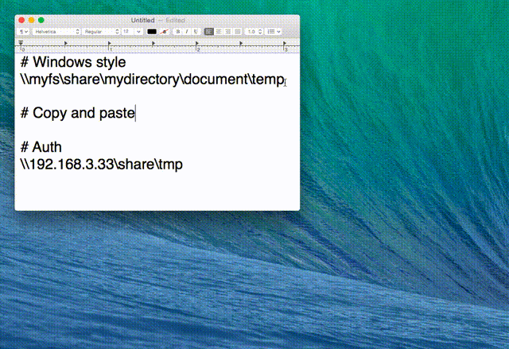
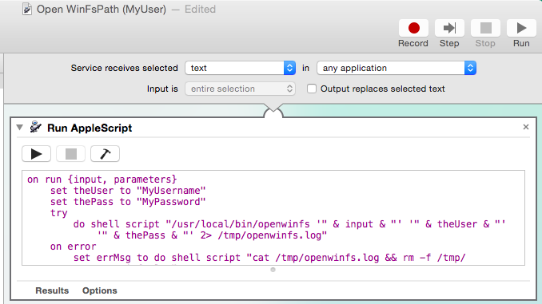

# osx-open-winfs
Open a network file path with Windows style.



## Features
 * Supporting SMB file server.
 * **Keeping its hierarchy:**  Once the volume is mounted, it allows you to move to parent directory from the first path.
 * **Copying feature:** Storing file/directory path with Windows style to the clipboard.
 * Multi-byte character like 日本語 can be handled.
 * **Authentification feature:** User & Password can be used for logging in (Fixed user can be used. Please refer to [Customize](# Customize))

## Install

* Execute following commands (**sudo privilege is necessary**).

```sh
   $ git clone https://github.com/greymd/osx-open-winfs.git
   $ cd osx-open-winfs
   $ sudo make install
   # /mnt_openwinfs directory will be created.
```

Please make sure following Services are enabled.


You can check from `Service Prefereces` -> `Keyboard` -> `Shortcuts` -> `Services`.

# Usage

## GUI

### Open the path with Windows style

Drag over the text which starts with `\\`.

Then click `Services` -> `Open WinFsPath (Guest)` or `Open WinFsPath (Auth)`

* **Open WinFsPath (Guest) :** `Guest` and empty password are automatically used.

* **Open WinFsPath (Auth) :** Fill in the username and password.

### Copy the path with Windows style

Select the particular file or directory.

Then click `Services` -> `Copy WinFsPath`

## CLI

``openwinfs`` command is available.

```sh
$ openwinfs '\\192.168.1.1\VolumeName\Dirname'
```

It works even...

```sh
# Network host is bound to particular domain name.
$ openwinfs '\\fsname\VolumeName\Dirname'

# File/directory name includes multibyte characters.
$ openwinfs '\\192.168.3.33\部長専用\秘密の動画.mp4'
```

Fill in second and third arguments ,if you need authentication.

```sh
$ openwinfs '\\fsname\VolumeName\Dirname' 'username' 'password'

# "Guest" and empty password are automatically used in case of single argument.
$ openwinfs '\\fsname\VolumeName\Dirname'
```

# Customize
Let's use particular username and password ALWAYS.

1. Go to `~/Library/Services/`
2. Duplicate `~/Library/Services/Open WinFsPath (Guest).workflow`.
+ And rename it as you like. i.e, `Open WinFsPath (MyUser).workflow`
3. Double click the file, open Automator and edit it as following, and overwrite it.

```AppleScript
set theUser to "MyUsername" -- Fill in the username you want to use.
set thePass to "MyPassword" -- Fill in its password.
```



Finally, the new workflow is available.

# Uninstall
* Execute following commands under the repository's directory.

```sh
   $ sudo make uninstall

   # ""IF YOU MIND"", please delete /mnt_openwinfs directory.
   ## Before deleting it, please make sure any volumes is not mounted under /mnt_openwinfs directory.
   $ mount | /usr/bin/grep -oE '/mnt_openwinfs/[^ ]*' | xargs -I@ umount @

   ## And delete it.
   $ rm -r /mnt_openwinfs
```

# License
This software is released under the MIT License, see [LICENSE](./LICENSE).
